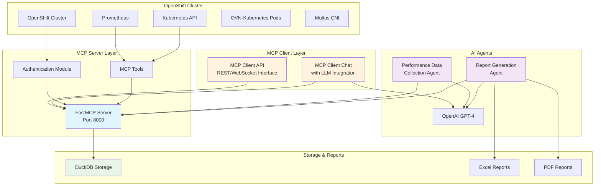

# OpenShift OVN-Kubernetes Benchmark MCP Server

A comprehensive benchmarking and performance monitoring solution for OpenShift clusters using OVN-Kubernetes networking, built with FastMCP and AI-powered analysis.

## Architecture Overview

## Architecture Topology

```
┌─────────────────────────────────────────────────────────────────────────────────┐
│                           OpenShift Cluster                                      │
│  ┌──────────────────┐    ┌──────────────────┐    ┌──────────────────┐          │
│  │   Kubernetes     │    │   Prometheus     │    │  OVN-Kubernetes  │          │
│  │      API         │    │    Metrics       │    │    Components    │          │
│  └──────────────────┘    └──────────────────┘    └──────────────────┘          │
└─────────────────────────────────────────────────────────────────────────────────┘
                                    │
                                    │ KUBECONFIG + SA Token
                                    │
┌─────────────────────────────────────────────────────────────────────────────────┐
│                           MCP Server Application                                  │
│                                                                                   │
│  ┌──────────────────┐    ┌──────────────────┐    ┌──────────────────┐          │
│  │   Authentication │    │   Data Collection│    │   Performance    │          │
│  │     Module       │    │      Tools       │    │    Analysis      │          │
│  │                  │    │                  │    │                  │          │
│  │  • Auth Manager  │    │  • Cluster Info  │    │  • Bottleneck    │          │
│  │  • Token Mgmt    │    │  • Prometheus    │    │    Detection     │          │
│  │                  │    │    Queries       │    │  • Trend Analysis│          │
│  └──────────────────┘    └──────────────────┘    └──────────────────┘          │
│                                    │                                             │
│  ┌──────────────────┐    ┌──────────────────┐    ┌──────────────────┐          │
│  │   Data Storage   │    │   ETL Processing │    │   Report Gen.    │          │
│  │                  │    │                  │    │                  │          │
│  │  • DuckDB        │    │  • JSON to Table │    │  • Excel Reports │          │
│  │  • Time Series   │    │  • Data Transform│    │  • PDF Summary   │          │
│  │    Storage       │    │  • Aggregation   │    │  • HTML Dashboard│          │
│  └──────────────────┘    └──────────────────┘    └──────────────────┘          │
│                                                                                   │
│  ┌─────────────────────────────────────────────────────────────────────────────┐│
│  │                        AI Agents (LangGraph)                                 ││
│  │                                                                               ││
│  │  ┌──────────────────┐              ┌──────────────────┐                     ││
│  │  │  Performance     │              │   Report         │                     ││
│  │  │  Data Agent      │              │   Generation     │                     ││
│  │  │                  │              │   Agent          │                     ││
│  │  │ • Collect Metrics│              │ • Analyze Data   │                     ││
│  │  │ • Store in DB    │              │ • Compare History│                     ││
│  │  │ • Real-time Mon. │              │ • Generate Report│                     ││
│  │  └──────────────────┘              └──────────────────┘                     ││
│  └─────────────────────────────────────────────────────────────────────────────┘│
└─────────────────────────────────────────────────────────────────────────────────┘
                                    │
                                    │ MCP Protocol (StreamableHTTP)
                                    │
┌─────────────────────────────────────────────────────────────────────────────────┐
│                              MCP Client Chat/API                                │
│                         (Claude/LLM Interface)                                  │
└─────────────────────────────────────────────────────────────────────────────────┘
```



## Features

### 🔧 Core Capabilities
- **Automated Authentication**: Discovers and authenticates with OpenShift/Kubernetes clusters
- **Multi-Source Monitoring**: Collects metrics from Prometheus, Kubernetes API, and cluster resources
- **AI-Powered Analysis**: Uses LangGraph and OpenAI for intelligent insights and recommendations
- **Comprehensive Reporting**: Generates Excel and PDF reports with visualizations
- **Historical Tracking**: Stores performance data in DuckDB for trend analysis

### 📊 Monitored Components
- **Kubernetes API Server**: Request latency, throughput, and error rates
- **Multus CNI**: Resource usage and pod networking performance
- **OVN-Kubernetes Pods**: Control plane and node performance
- **OVN Containers**: Database sizes, memory usage, and sync performance
- **OVS Components**: CPU and memory usage of OVS processes
- **General Cluster Info**: NetworkPolicies, AdminNetworkPolicies, EgressFirewalls

### 🤖 AI Features
- Automated performance trend analysis
- Intelligent alert correlation
- Proactive recommendations
- Risk assessment and health scoring
- Natural language insights

## Quick Start

### Prerequisites

- Python 3.9+
- OpenShift/Kubernetes cluster access
- KUBECONFIG file
- OpenAI API key (for AI features)

### Installation

1. **Clone and Setup**
   ```bash
   git clone <repository>
   cd ocp-benchmark-mcp
   chmod +x ovnk_benchmark_mcp_command.sh
   ./ovnk_benchmark_mcp_command.sh setup
   ```

2. **Test Configuration**
   ```bash
   ./ovnk_benchmark_mcp_command.sh -k ~/.kube/config test
   ```

### Usage

#### Start MCP Server
```bash
# Start server (runs on port 8000)
./ovnk_benchmark_mcp_command.sh -k ~/.kube/config server
```

#### Collect Performance Data
```bash
# Collect data for 10 minutes
./ovnk_benchmark_mcp_command.sh -k ~/.kube/config -d 10m collect
```

#### Generate Reports
```bash
# Generate report for last 7 days
./ovnk_benchmark_mcp_command.sh -o sk-your-openai-key -p 7 report
```

#### Full Workflow
```bash
# Collect data and generate report
./ovnk_benchmark_mcp_command.sh -k ~/.kube/config -o sk-your-openai-key full
```

## Project Structure

```
ocp-benchmark-mcp/
├── README.md                                    # This file
├── pyproject.toml                              # Python project configuration
├── ovnk_benchmark_mcp_server.py               # Main MCP server
├── ovnk_benchmark_mcp_agent_perfdata.py       # Data collection agent
├── ovnk_benchmark_mcp_agent_report.py         # Report generation agent
├── ovnk_benchmark_mcp_command.sh              # Startup script
├── ocauth/
│   └── ovnk_benchmark_auth.py                 # OpenShift authentication
├── tools/
│   ├── ovnk_benchmark_openshift_generalinfo.py # Cluster general info
│   ├── ovnk_benchmark_prometheus_basequery.py  # Base Prometheus queries
│   ├── ovnk_benchmark_prometheus_kubeapi.py    # API server metrics
│   ├── ovnk_benchmark_prometheus_multus.py     # Multus CNI metrics
│   ├── ovnk_benchmark_prometheus_ovnk_pods.py  # OVN-K pod metrics
│   ├── ovnk_benchmark_prometheus_ovnk_containers.py # OVN container metrics
│   └── ovnk_benchmark_prometheus_ovnk_sync.py  # OVN sync metrics
├── config/
│   ├── ovnk_benchmark_config.py               # Configuration management
│   └── metrics.yml                            # Prometheus metrics definitions
├── analysis/
│   └── ovnk_benchmark_performance_analysis.py # Performance analysis
├── elt/
│   └── ovnk_benchmark_performance_elt.py      # Data processing
├── storage/
│   └── ovnk_benchmark_prometheus_ovnk.py      # DuckDB storage
└── exports/                                    # Generated reports
```

## Configuration

### Environment Variables

| Variable | Description | Default |
|----------|-------------|---------|
| `KUBECONFIG` | Path to kubeconfig file | `~/.kube/config` |
| `OPENAI_API_KEY` | OpenAI API key for AI features | Required for reports |
| `MCP_SERVER_URL` | MCP server URL | `http://localhost:8000` |
| `COLLECTION_DURATION` | Metrics collection duration | `5m` |
| `REPORT_PERIOD_DAYS` | Report period in days | `7` |
| `DATABASE_PATH` | DuckDB database path | `storage/ovnk_benchmark.db` |
| `REPORT_OUTPUT_DIR` | Report output directory | `exports` |

### Metrics Configuration

The `config/metrics.yml` file defines all Prometheus queries organized by category:

- **General Information**: Pod and namespace status
- **API Server**: Request latency and error rates
- **Multus**: CNI resource usage
- **OVN Control Plane/Node**: CPU and memory metrics
- **OVN Containers**: Database and controller metrics
- **OVS Containers**: OVS daemon metrics
- **OVN Sync**: Synchronization duration metrics

## API Reference

### MCP Tools

The server exposes the following MCP tools:

#### `get_openshift_general_info`
Get general cluster information including NetworkPolicy, AdminNetworkPolicy, and EgressFirewall counts.

**Parameters:**
- `namespace` (optional): Specific namespace to query

**Response:**
```json
{
  "timestamp": "2024-01-01T00:00:00Z",
  "summary": {
    "total_networkpolicies": 10,
    "total_adminnetworkpolicies": 2,
    "total_egressfirewalls": 5,
    "total_namespaces": 25,
    "total_nodes": 6
  }
}
```

#### `query_kube_api_metrics`
Query Kubernetes API server performance metrics.

**Parameters:**
- `duration` (optional): Query duration (default: "5m")
- `start_time` (optional): Start time in ISO format
- `end_time` (optional): End time in ISO format

#### `query_multus_metrics`
Query Multus CNI performance metrics.

#### `query_ovnk_pods_metrics`
Query OVN-Kubernetes pod performance metrics.

#### `query_ovnk_containers_metrics`
Query OVN-Kubernetes container metrics.

#### `query_ovnk_sync_metrics`
Query OVN-Kubernetes synchronization metrics.

#### `store_performance_data`
Store performance data in DuckDB.

#### `get_performance_history`
Retrieve historical performance data.

## AI Agents

### Performance Data Collection Agent

Uses LangGraph to orchestrate data collection:

1. **Initialize**: Setup collection parameters
2. **Collect General Info**: Gather cluster information
3. **Collect Metrics**: Query each component category
4. **Store Data**: Save to DuckDB storage
5. **Finalize**: Generate collection summary

### Report Generation Agent

Uses LangGraph with AI analysis:

1. **Fetch Historical Data**: Retrieve performance history
2. **Analyze Performance**: Calculate trends and statistics
3. **Generate Insights**: Use AI for recommendations
4. **Create Reports**: Generate Excel and PDF reports
5. **Finalize**: Output summary and files

## Storage Schema

### DuckDB Tables

- **`metrics`**: Individual metric data points
- **`metric_summaries`**: Category performance summaries
- **`performance_snapshots`**: Complete performance snapshots
- **`benchmark_runs`**: Benchmark execution records
- **`alerts_history`**: Historical alert data

## Report Types

### Excel Reports

- **Executive Summary**: Key performance indicators
- **Historical Trends**: Time-series performance data
- **Category Analysis**: Component-specific metrics
- **Recommendations**: AI-generated insights
- **Raw Data**: Complete dataset

### PDF Reports

- **Executive Summary**: High-level performance overview
- **Key Metrics**: Performance indicator tables
- **Category Analysis**: Component performance breakdown
- **Recommendations**: Prioritized action items

## Troubleshooting

### Common Issues

#### Authentication Problems
```bash
# Test cluster connectivity
kubectl cluster-info

# Verify kubeconfig
export KUBECONFIG=/path/to/config
./ovnk_benchmark_mcp_command.sh test
```

#### Prometheus Discovery
```bash
# Check Prometheus pods
kubectl get pods -n openshift-monitoring | grep prometheus

# Verify service accounts
kubectl get sa -n openshift-monitoring
```

#### MCP Server Issues
```bash
# Check server logs
tail -f logs/mcp_server_*.log

# Test server connectivity
curl http://localhost:8000/health
```

### Debug Mode

Enable debug logging:
```bash
export LOG_LEVEL=DEBUG
export OVNK_LOG_LEVEL=DEBUG
./ovnk_benchmark_mcp_command.sh server
```

## Contributing

1. **Fork the repository**
2. **Create a feature branch**
3. **Add tests for new functionality**
4. **Submit a pull request**

### Development Setup

```bash
# Install development dependencies
pip install -e .[dev]

# Run tests
pytest

# Format code
black .

# Type checking
mypy .
```

## License

MIT License - see LICENSE file for details.

## Support

For issues and questions:

1. **Check the troubleshooting section**
2. **Review logs in the `logs/` directory**
3. **Open an issue with detailed logs and configuration**

## Roadmap

- [ ] Kubernetes native deployment (Helm charts)
- [ ] Grafana dashboard integration
- [ ] Custom alert rule definitions
- [ ] Multi-cluster support
- [ ] Real-time streaming metrics
- [ ] Advanced ML-based anomaly detection
- [ ] Integration with CI/CD pipelines

---

**Note**: This tool is designed for OpenShift clusters with OVN-Kubernetes networking. Some features may not be available on other Kubernetes distributions.